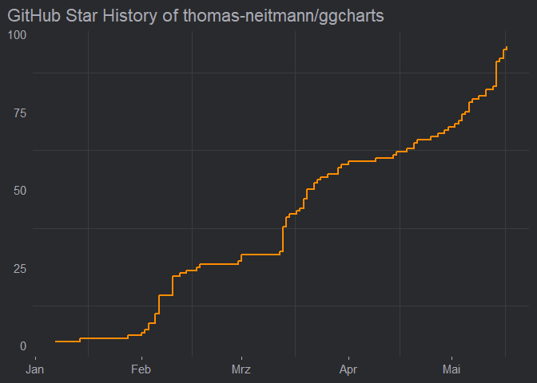
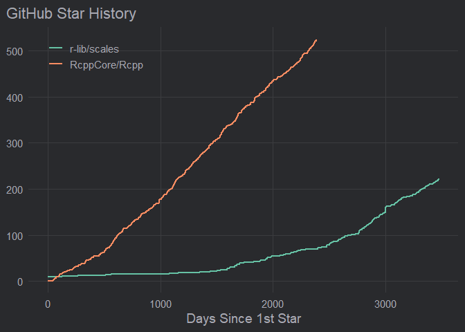

ghstars
================

## Motivation

Developers love GitHub. Even more so, they love seeing the stars of
their repos rise. This is evident in the popularity of website’s such
[star-history.t9t.io](https://star-history.t9t.io/) which created plots
like this one.


Having a website to create these kind of plots in great but I thought it
would be even better to have an `R` package to do so. That’s why I
created `{ghstars}`.

## Overview

`get_repo_star_history()` is the work horse of `{ghstars}`. It fetches
the star history of any GitHub repository via the GitHub API thanks to
the `{gh}` package. Its associated plot method creates a stunning
visualization of the star history.

``` r
library(ghstars)
star_history <- get_repo_star_history("thomas-neitmann/ggcharts")
head(star_history)
```

    ##                       repo       date day stars cumulative_stars
    ## 1 thomas-neitmann/ggcharts 2020-01-07   0     1                1
    ## 2 thomas-neitmann/ggcharts 2020-01-14   7     1                2
    ## 3 thomas-neitmann/ggcharts 2020-01-28  21     1                3
    ## 4 thomas-neitmann/ggcharts 2020-02-01  25     1                4
    ## 5 thomas-neitmann/ggcharts 2020-02-02  26     1                5
    ## 6 thomas-neitmann/ggcharts 2020-02-03  27     2                7

``` r
plot(star_history)
```



`get_pkg_star_history()` is a shortcut for retrieving the star history
of `R` packages. It allows you to pass just the package name instead of
the whole repo name as its argument. The function searches for the
GitHub repo of the package. If it is successful it calls
`get_repo_star_history()`. If not, an error is thrown.

``` r
star_histories <- get_pkg_star_history(c("Rcpp", "scales"))
plot(star_histories)
```



## Installation

The package is currently only available from GitHub.

``` r
if (!"remotes" %in% installed.packages()) {
  install.packages("remotes")
}
remotes::install_github("thomas-neitmann/ghstars", upgrade = "never")
```

If you get an error when trying to install, run this code and then try
to install once again.

``` r
Sys.setenv(R_REMOTES_NO_ERRORS_FROM_WARNINGS = "true")
```

If the installation still fails please open an issue.
